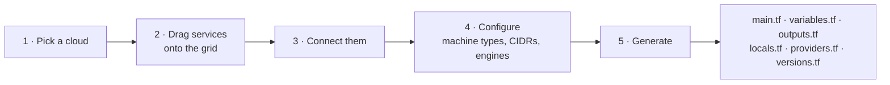
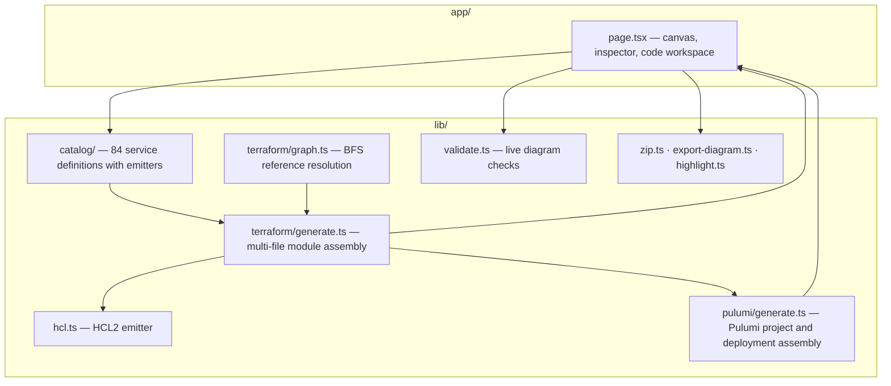

<div align="center">

# ◢ InfraCanvas

### Draw your cloud architecture. Generate deployable Terraform or Pulumi.

[](../../actions/workflows/ci.yml)
[](https://nextjs.org/)
[](https://react.dev/)
[](https://www.terraform.io/)
[](https://www.pulumi.com/)
[](https://workers.cloudflare.com/)
[](LICENSE)

**A visual infrastructure builder for AWS, Azure, Google Cloud, and Oracle Cloud.**
**84 services across 4 clouds. Terraform and Pulumi output from the same connected diagram.**

</div>

---

## The one thing most diagram-to-IaC tools get wrong

They render your boxes, then emit Terraform full of `null` placeholders and `# TODO`
comments that you have to wire up by hand. At that point the diagram was decoration.

**InfraCanvas treats every connection you draw as a real Terraform reference.**

Connect a subnet to an EC2 instance and the generated `aws_instance` gets
`subnet_id = aws_subnet.<the one you drew>.id`. Connect a security group and it lands in
`vpc_security_group_ids`. Connect an explicit target group to an EC2 fleet and you get
real target registration, listener forwarding, and health checks.

```hcl
# Generated from a 7-node diagram — every reference resolved from the edges
resource "aws_instance" "ec2_5" {
  count                       = 2
  ami                         = data.aws_ami.amazon_linux.id
  instance_type               = "t3.micro"
  subnet_id                   = element([aws_subnet.subnet_2.id], count.index)
  vpc_security_group_ids      = [aws_security_group.security_group_3.id]
  associate_public_ip_address = false
  ebs_optimized               = true

  root_block_device {
    volume_size = 20
    volume_type = "gp3"
    encrypted   = true
  }

  metadata_options {
    http_tokens = "required" # IMDSv2 enforced by default
  }

  tags = merge(local.tags, { Name = "ec2-5-${count.index + 1}" })
}

resource "aws_lb_target_group_attachment" "ec2_5" {
  count            = 2
  target_group_arn = aws_lb_target_group.alb_4.arn
  target_id        = aws_instance.ec2_5[count.index].id
  port             = 80
}
```

Nothing you drew is left as a placeholder. When a resource genuinely *isn't* connected to
anything, InfraCanvas declares a typed input variable for it and tells you which ones —
it never emits `= null` and hopes you notice.

## How it works



1. **Choose a provider.** AWS, Azure, GCP, or Oracle Cloud. The sidebar loads that cloud's
   services grouped exactly the way the provider organises them.
2. **Compose.** Drag services onto the canvas. Marquee-select, multi-drag, duplicate,
   undo, snap to grid.
3. **Connect.** Drag from a node port or use the connect tool. Edges are selectable and
   deletable.
4. **Configure.** Every node has real property controls — machine types, AMI families,
   database engines, storage classes, CIDR blocks, TLS policies — sourced from the actual
   provider schema, not free text.
5. **Generate.** Choose Terraform or Pulumi. One click produces either the validated
   multi-file Terraform module or a complete Pulumi TypeScript deployment project.

## Verified, not just "generated"

The generator has a test suite that puts **every service in every provider's catalog** on a
canvas, wires it up, and renders it. Then:

| Check | What it proves |
| --- | --- |
| `tofu fmt -check` | The output is byte-for-byte canonical HCL — it parses, and it is already formatted |
| Brace balance + no semicolon-separated arguments | Structural HCL correctness, per file |
| Reference assertions | Connected diagrams produce resource references, never `null` |
| Fallback assertions | Every unresolved reference has a matching `variable` block declared |
| ZIP round-trip | The downloaded archive extracts cleanly in an independent extractor |

And the strongest check, run against the real downloaded provider schemas:

```console
$ npm run emit:terraform && cd dist/emitted/aws && tofu init -backend=false && tofu validate
Success! The configuration is valid.
```

**All four providers pass `tofu validate`** — 144 resources across the full catalogs.

## What's in the box

| Provider | Services | Terraform provider |
| --- | --- | --- |
| **AWS** | 28 — VPC, Subnet, IGW, NAT, ALB, Target Group, CloudFront, Route 53, API Gateway, EC2, ASG, Lambda, ECS, EKS, ECR, RDS, DynamoDB, ElastiCache, S3, EFS, Security Group, WAF, KMS, Secrets Manager, IAM Role, SQS, SNS, CloudWatch | `hashicorp/aws ~> 6.0` |
| **Azure** | 19 — VNet, Subnet, Public IP, Application Gateway, Front Door, VM, App Service, Functions, AKS, ACR, PostgreSQL, Azure SQL, Cosmos DB, Redis, Storage Account, NSG, Key Vault, Service Bus, Log Analytics | `hashicorp/azurerm ~> 4.0` |
| **Google Cloud** | 20 — VPC, Subnetwork, Cloud NAT, Global LB, Cloud DNS, Compute Engine, Cloud Run, Cloud Functions, GKE, Artifact Registry, Cloud SQL, Firestore, Memorystore, BigQuery, Cloud Storage, Firewall, Secret Manager, Service Account, Pub/Sub, Monitoring | `hashicorp/google ~> 6.0` |
| **Oracle Cloud** | 18 — VCN, Subnet, IGW, NAT, Load Balancer, Compute, Functions, OKE, OCIR, Autonomous Database, MySQL HeatWave, Object Storage, File Storage, Security List, NSG, Vault, Streaming, Monitoring | `oracle/oci ~> 6.0` |

## Secure by default

The generated module is not a toy. Every emitter ships the safe option first:

- **Encryption on** — EBS volumes, S3 buckets, RDS storage, ElastiCache in transit and at
  rest, Azure Storage TLS 1.2 minimum, GCS uniform bucket-level access.
- **Public access blocked** — S3 public access block, GCS `public_access_prevention`,
  private cluster endpoints, `assign_public_ip = false`, OCI `NoPublicAccess`.
- **IMDSv2 required** on EC2 and launch templates.
- **Deletion protection and PITR** on databases; final snapshots on RDS.
- **Secrets are never literals.** Passwords, keys, and secret payloads are always
  `sensitive = true` variables with length validation, and the bundle ships a
  `.gitignore` that blocks `*.tfvars` and `*.tfstate`.

Live validation surfaces the rest as you draw: unconnected resources, missing subnets,
`0.0.0.0/0` ingress rules, malformed CIDRs, duplicate names.

The empty canvas can load a complete AWS production reference spanning every resource
category: dual-AZ public, application, and data tiers; CloudFront/WAF/ALB ingress; a
health-checked target group; EC2, Auto Scaling, ECS, and EKS workloads; protected data
services; encrypted storage; secrets, messaging, and operational alarms. EC2 and EKS
machine-type controls include recommendations across every AWS workload category and
also accept any region-supported custom instance type.

## Builder features

- **Canvas** — drag, marquee-select, multi-drag, snap to grid, pan, `Ctrl`+scroll zoom,
  zoom-to-fit, minimap
- **History** — full undo/redo, with a drag counting as a single step
- **Connections** — draw from either port, click-to-connect, select and delete edges,
  per-node connection list in the inspector
- **Inspector** — typed controls with conditional fields, live Terraform address preview,
  and a deep link to the registry docs for that resource
- **Code workspace** — switch between Terraform and Pulumi, inspect the full multi-file
  project, copy or download one file, or take the complete deployment bundle as a `.zip`
- **Exports** — the diagram as standalone SVG or 2× PNG, for your docs and PRs
- **Dark mode** — applied before first paint, no flash
- **Keyboard-first** — press <kbd>?</kbd> for the full map

## Pulumi support

The **Generate IaC** workspace now has Terraform and Pulumi output targets. Pulumi output
is a complete TypeScript project containing:

- `Pulumi.yaml`, `index.ts`, `package.json`, and `tsconfig.json`
- encrypted Pulumi stack configuration for sensitive inputs
- mapped outputs from every generated resource that exposes one
- `npm run preview`, `npm run deploy`, and `npm run destroy` workflows
- Windows `deploy.ps1` and macOS/Linux `deploy.sh` launchers
- the complete generated infrastructure module under `terraform/`

InfraCanvas uses Pulumi's official local Terraform Module provider. During bootstrap,
Pulumi creates a strongly typed local SDK for the generated module, manages the stack and
state, and automatically manages OpenTofu underneath. This preserves every provider
resource and connection across AWS, Azure, GCP, and OCI without maintaining a second,
partial resource catalog.

```bash
npm install
npm run bootstrap
# Set the required values printed by bootstrap with `pulumi config set`.
npm run preview
npm run deploy
```

Pulumi always presents its deployment preview for confirmation before changing cloud
infrastructure. See the [official local Terraform Module documentation](https://www.pulumi.com/docs/iac/guides/building-extending/using-existing-tools/use-terraform-module/).

## TFwhy drift detection

InfraCanvas integrates with [TFwhy](https://github.com/karthikmeduri91/tfwhy) to close the
gap between the architecture you designed and the infrastructure that actually exists.
Click **Drift** in the builder, run TFwhy beside your Terraform project, and import the
generated JSON report. InfraCanvas matches Terraform addresses to canvas nodes, adds
severity badges, and lets you jump from a finding directly to the affected resource.

```bash
# Fresh scan: Terraform refreshes the provider state, TFwhy analyzes the drift
tfwhy drift --chdir . --json > tfwhy-drift.json
```

For a fully offline TFwhy analysis step, create the refreshed plan first and then pass its
JSON to TFwhy:

```bash
terraform plan -refresh-only -out=tfplan
terraform show -json tfplan > plan.json
tfwhy drift plan.json --offline --json > tfwhy-drift.json
```

The report is parsed entirely in the browser tab. InfraCanvas does not upload the report,
Terraform state, or cloud credentials, and it deliberately does not execute Terraform in
the hosted web application. See [the integration and security model](docs/tfwhy-integration.md).

<details>
<summary><b>Keyboard shortcuts</b></summary>

| Keys | Action |
| --- | --- |
| <kbd>Ctrl/⌘</kbd> + <kbd>↵</kbd> | Generate Terraform or Pulumi |
| <kbd>Ctrl/⌘</kbd> + <kbd>Z</kbd> / <kbd>⇧Z</kbd> | Undo / redo |
| <kbd>Ctrl/⌘</kbd> + <kbd>D</kbd> | Duplicate selection |
| <kbd>Ctrl/⌘</kbd> + <kbd>A</kbd> | Select all |
| <kbd>Ctrl/⌘</kbd> + <kbd>S</kbd> | Save project |
| <kbd>Delete</kbd> | Remove selection |
| <kbd>C</kbd> / <kbd>H</kbd> | Connect tool / hand tool |
| <kbd>G</kbd> / <kbd>F</kbd> | Toggle snap / zoom to fit |
| <kbd>/</kbd> | Search services |
| <kbd>Esc</kbd> | Cancel or clear selection |

</details>

## Getting started

Requires Node.js `22.13.0` or newer.

```bash
git clone https://github.com/karthikmeduri/InfraCanvas.git
cd InfraCanvas
npm install
npm run dev
```

Open <http://localhost:3000>.

If you use GitHub's **Download ZIP** option instead of `git clone`, the extracted
directory is normally named `InfraCanvas-main`, so enter it with:

```bash
cd InfraCanvas-main
```

```bash
npm run build       # production build (Cloudflare Workers)
npm run typecheck   # tsc --noEmit
npm run lint        # eslint
npm test            # build + generator suite + SSR smoke test
```

Everything runs client-side. There is no backend, no account, and no telemetry — your
diagram is saved to `localStorage` and nowhere else.

## Architecture



The interesting part is `lib/terraform/graph.ts`. It runs a breadth-first search from each
node over the undirected diagram, so a resource finds its network even when the edge is
indirect — an EC2 instance connected to a subnet that is connected to a VPC resolves the
VPC at distance 2. List references (`subnet_ids`, `security_group_ids`) only use resources
you actually connected. Singular references fall back to a lone unconnected resource of
the right kind, because that is almost always what you meant.

`lib/hcl.ts` is a real HCL2 emitter rather than string concatenation — it builds a tree and
renders it once, reproducing `terraform fmt`'s alignment rules including the way a
multi-line value breaks an alignment group.

## Adding a service

One `defineService` block. Nothing else to register.

```ts
defineService({
  id: "ecr",
  name: "ECR Repository",
  short: "ECR",
  category: "Containers",
  role: "registry",        // how the graph resolver sees it
  tfType: "aws_ecr_repository",
  description: "Private container image registry",
  fields: [
    select("mutability", "Tag mutability", ["IMMUTABLE", "MUTABLE"]),
    toggle("scan_on_push", "Scan on push", true),
  ],
  emit: (c) => [
    resource("aws_ecr_repository", c.name, [
      attr("name", str(dnsName(c.display, "repository", 60))),
      attr("image_tag_mutability", str(c.v.mutability || "IMMUTABLE")),
      block("image_scanning_configuration", [], [
        attr("scan_on_push", flag(c.v.scan_on_push, true)),
      ]),
      attr("tags", c.tags),
    ]),
  ],
});
```

The icon comes from the `role`, the sidebar grouping from the `category`, and the graph
resolver picks it up automatically. See [CONTRIBUTING.md](CONTRIBUTING.md).

## Roadmap

- [ ] Import existing Terraform back onto the canvas
- [ ] Nested VPC / VNet / VCN container groups
- [ ] Cost estimates per node
- [ ] Reusable module output instead of a flat file set
- [ ] Shareable project links and team workspaces
- [x] TFwhy drift report visualisation and canvas highlighting

## Contributing

Issues and pull requests are welcome. Keep additions provider-aware, keyboard accessible,
secure by default, and covered by the generator test suite — a new service should pass
`tofu fmt` and `tofu validate` before it ships.

## Authors

InfraCanvas is an original idea jointly conceived by:

| Author | Contribution |
| --- | --- |
| **Karthik Meduri** | Co-author and co-creator |
| **Sai Sravan Meduri** | Co-author and co-creator |

## License

[Apache License 2.0](LICENSE) — use it, adapt it, and build something excellent.

---

<div align="center">

**InfraCanvas** · Infrastructure design that stays close to the code.

</div>
