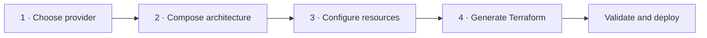
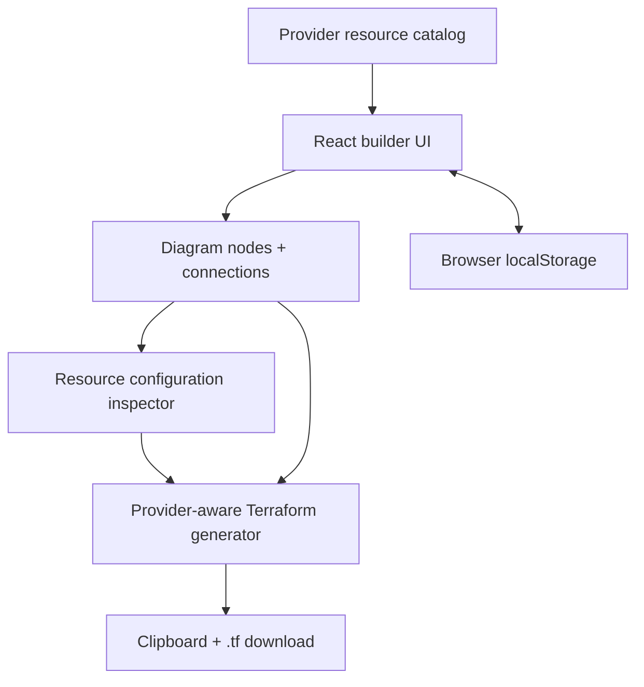

<div align="center">

# ◢ InfraCanvas

### Draw cloud architecture. Configure real values. Generate Terraform.

[](https://nextjs.org/)
[](https://react.dev/)
[](https://www.terraform.io/)
[](https://workers.cloudflare.com/)
[](#license)

**A modern visual infrastructure builder for AWS, Azure, Google Cloud, and Oracle Cloud.**

</div>

---

## What is InfraCanvas?

InfraCanvas turns cloud architecture into editable infrastructure-as-code. Choose a provider, drag native cloud services onto the canvas, connect them, configure real resource values, and export a complete Terraform starting template.

The included application is an interactive front-end prototype—not a static design:

- Drag services from the provider library onto the canvas
- Reposition resources and connect them visually
- Configure machine types, regions, database engines, storage classes, network ranges, and more
- Generate provider-specific Terraform from the current diagram
- Copy the generated code or download it as a `.tf` file
- Save the current project locally in the browser
- Start from a realistic sample architecture for every provider

## Product workflow



1. **Choose a cloud** — AWS, Azure, GCP, or OCI.
2. **Design visually** — drag provider services to the grid and arrange the system.
3. **Configure precisely** — select any resource and define its infrastructure values.
4. **Connect the flow** — enable Connect mode and select the source and destination.
5. **Generate code** — review, copy, or download the generated Terraform.

## Supported provider libraries

| Provider | Example services |
| --- | --- |
| **AWS** | VPC, Subnet, ALB, CloudFront, EC2, Lambda, ECS, EKS, RDS, DynamoDB, S3, Security Groups, WAF |
| **Azure** | Virtual Network, Subnet, Application Gateway, Virtual Machine, Functions, AKS, Azure SQL, Cosmos DB, Blob Storage, NSG |
| **Google Cloud** | VPC, Subnetwork, Cloud Load Balancing, Compute Engine, Cloud Run, GKE, Cloud SQL, Firestore, Cloud Storage, Firewall |
| **Oracle Cloud** | VCN, Subnet, Load Balancer, Compute, Functions, OKE, Autonomous Database, MySQL HeatWave, Object Storage, Security Lists |

## Design highlights

The interface uses a purpose-built design system for technical tools:

- A focused, high-density workspace with a bright canvas and restrained chrome
- Provider-aware colors without turning the product into a rainbow dashboard
- Accessible labels, visible focus rings, high-contrast text, and reduced-motion support
- Responsive slide-over panels for smaller screens
- Persistent configuration inspector and inline Terraform preview
- Zero image dependencies: the UI remains fast and crisp at every scale

## Getting started

### Requirements

- Node.js `22.13.0` or newer
- npm `10` or newer

### Run locally

```bash
git clone <your-repository-url>
cd TF-visual-builder
npm install
npm run dev
```

Open [http://localhost:3000](http://localhost:3000).

### Production build

```bash
npm run build
npm test
```

## Project structure

```text
TF-visual-builder/
├── app/
│   ├── globals.css          # Complete responsive product design system
│   ├── layout.tsx           # Product metadata and application shell
│   └── page.tsx             # Builder, canvas, configuration, and code generator
├── design-system/
│   └── infracanvas/         # Persisted visual design guidance
├── public/
│   └── favicon.svg
├── tests/
│   └── rendered-html.test.mjs
├── worker/                  # Cloudflare Worker entry
├── package.json
└── vite.config.ts
```

## Terraform output

InfraCanvas produces a structured, provider-aware Terraform template containing:

- Required Terraform and provider versions
- Provider configuration
- Input variables
- Shared locals and tags
- Resource blocks derived from the diagram
- Diagram relationship notes
- A generated architecture summary output

The builder deliberately labels unresolved cross-resource identifiers as placeholders. Cloud accounts, network IDs, secrets, certificates, and organization policies differ, so review the generated template before deployment.

Recommended validation flow:

```bash
terraform fmt
terraform init
terraform validate
terraform plan
```

> [!IMPORTANT]
> Never commit passwords, private keys, cloud credentials, or production secrets. Pass sensitive values through environment variables, an encrypted variable store, or your CI/CD secret manager.

## Current architecture



## Roadmap

- [ ] Multi-file ZIP export with reusable Terraform modules
- [ ] Import existing Terraform into the visual canvas
- [ ] Undo/redo history and multi-select
- [ ] Nested VPC/VNet/VCN containers
- [ ] Real-time architecture validation and cost hints
- [ ] Team workspaces, comments, and version history
- [ ] GitHub pull request export
- [ ] `terraform plan` visualization

## Contributing

Issues and pull requests are welcome. Keep additions provider-aware, keyboard accessible, and consistent with the existing component and color system.

## License

MIT — use it, adapt it, and build something excellent.

---

<div align="center">

**InfraCanvas** · Infrastructure design that stays close to the code.

</div>
