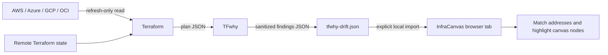

# TFwhy + InfraCanvas

TFwhy is InfraCanvas's local drift-analysis companion. The boundary is intentional:
Terraform and cloud credentials stay on the operator's machine; InfraCanvas receives a
small, deterministic JSON report through a user-selected file and renders the result.

## Data flow



InfraCanvas never asks for cloud credentials, backend credentials, or a `.tfstate` file.
The current integration has no server endpoint: `File.text()` and the report parser run in
the browser, and report contents live only in React memory until the tab is closed or the
user clears the report.

## Fresh drift scan

From the root of the Terraform/OpenTofu configuration:

```bash
tfwhy drift --chdir . --json > tfwhy-drift.json
```

With no plan argument, TFwhy invokes `terraform plan -refresh-only`, which reads the
configured backend and cloud APIs using the user's existing local authentication. TFwhy's
deterministic drift engine then emits the `resource_drift` findings as JSON. No LLM is
needed for the InfraCanvas workflow.

## Strict offline analysis

`--offline` correctly refuses to invoke Terraform because Terraform may contact a remote
backend and cloud provider. Produce the plan first, then analyze the resulting JSON:

```bash
terraform plan -refresh-only -out=tfplan
terraform show -json tfplan > plan.json
tfwhy drift plan.json --offline --json > tfwhy-drift.json
```

The first two commands still contact the configured backend/providers when required. The
final TFwhy command makes no network calls.

## JSON contract

InfraCanvas consumes the stable output of `tfwhy drift --json`:

```json
{
  "counts": {},
  "errored": false,
  "warnings": [],
  "findings": [
    {
      "severity": "MEDIUM",
      "address": "aws_security_group.web",
      "type": "aws_security_group",
      "action": "update",
      "title": "aws_security_group.web was modified outside of Terraform",
      "detail": "Drifted attributes: ingress",
      "stateful": false
    }
  ]
}
```

Imports are limited to 5 MB and 5,000 findings. Required fields and severities are
validated before anything is displayed.

## Address matching

The canvas derives each primary Terraform address from its configured service type and
resource name. Matching supports:

- exact addresses such as `aws_instance.app`
- counted/for-each instances such as `aws_instance.app[0]`
- module prefixes such as `module.compute.aws_instance.app[0]`
- a type-only fallback only when exactly one canvas node has that Terraform type

Ambiguous findings remain visible as **Not on this canvas**; InfraCanvas does not guess.
One visual node may emit supporting Terraform resources in addition to its primary type.
Those secondary addresses remain unmatched until the canvas models them as independent
resources.

## Team workflow

Store Terraform state in a remote backend with locking and run drift scans in scheduled CI
or before editing/applying. A recommended team loop is:

1. Pull the current configuration and acquire the normal Terraform state lock.
2. Run the refresh-only TFwhy command.
3. Import the report into InfraCanvas and investigate highlighted resources.
4. Decide whether configuration should adopt the manual change or Terraform should revert it.
5. Review a normal `terraform plan` before applying.

The report is evidence, not an apply action. InfraCanvas never changes infrastructure from
a drift finding.
